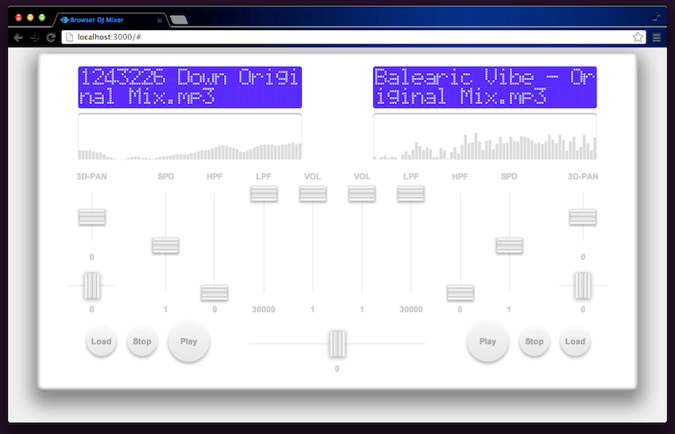

# BrowserDJ

DJ Mixer for a Web Browser.

## Environment

- Supported Browser:
    - Google Chrome (Recommended)
    - Mozilla Firefox

## Installation

	npm install -g browserdj

## Getting Started

### Node.js

1. Execute a command.

        browserdj

2. Go to a [http://localhost:3000](http://localhost:3000).

### Javascript and HTML

1. Compile.

        ./compile.sh

2. Open index.html in the `public` directory.

## Screenshot

## Heroku hosting

[Browser DJ Mixer at Heroku](http://browserdj.herokuapp.com/#) : old version

## License

[MIT](http://opensource.org/licenses/MIT) license.

